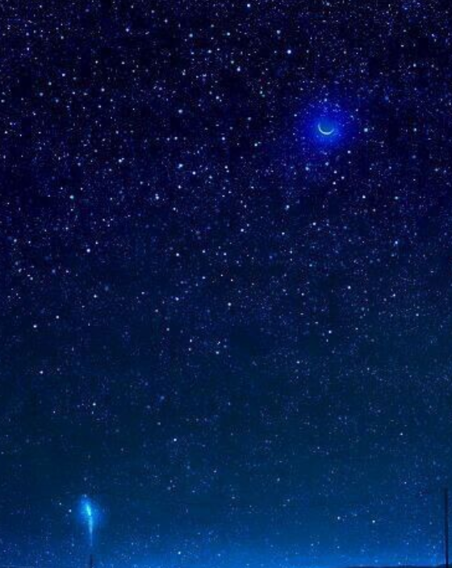
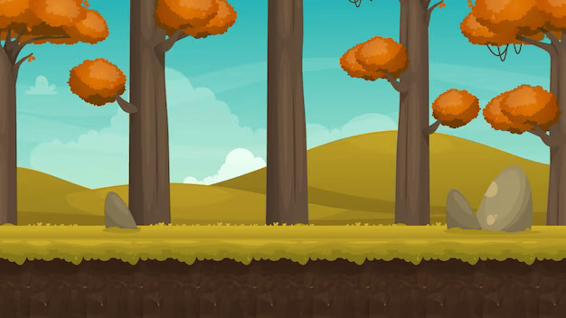

# Gun Battle
- Link preview game :  
## Giới thiệu
Gun Battle là một trò chơi bắn súng đơn giản được xây dựng bằng ngôn ngữ lập trình C++ và sử dụng thư viện đồ hoạ SDL. Trong trò chơi này, người chơi sẽ điều khiển một nhân vật và bắn hạ các kẻ địch để kiếm điểm.

## Cài đặt
Để chạy trò chơi, bạn cần có môi trường phát triển C++ (ví dụ: Visual Studio) và cài đặt thư viện SDL. Sau đó, bạn có thể mở mã nguồn và chạy trò chơi từ môi trường phát triển của mình.

## Hướng dẫn sử dụng
- Khi chạy trò chơi, bạn sẽ thấy một menu hiển thị lựa chọn "Start" và "Exit".
- Nếu bạn chọn "Start", game sẽ chuyển đến 1 menu hướng dẫn, sau đó 10 giây để đọc thông tin và chơi.
- Nếu bạn chọn "Exit", trò chơi sẽ kết thúc.
- Trong quá trình chơi, nếu bạn hạ được 20 mục tiêu hoặc đạt được 200 điểm (mỗi mục tiêu = 10 điểm) thì bạn thắng và màn hình sẽ hiển thị “You win“. Nếu bạn sử dụng hết trái tim thì bạn thua và màn hình sẽ hiển thị “Game over!”.
- Sau đó sẽ hiển thị menu end game gồm 2 lựa chọn: “play again“ và “exit”. Chọn “Play Again” sẽ chơi lại, còn chọn “Exit” sẽ thoát game.

## Nguồn 
Các hình ảnh trong game tự thiết kế hoặc tìm ngẫu nhiên trên Google và một số là ảnh screenshot.

## Bắt đầu game
- **Background Đầu Tiên (Menu):** 
  - File: `SDL_GAME_1/resources/bkgd_menu.png`
  - Mô tả: Background này chứa các lựa chọn "Start" và "Exit" được viết bằng font.
  

- **Background Hướng Dẫn:**
  - File: `SDL_GAME_1/resources/Screenshot 2024-04-06 121850.png`
  - Mô tả: Background này được sử dụng để hướng dẫn người chơi về cách chơi trò chơi. Và có đếm ngược 10s cho người chơi đọc thông tin 
  - Welcome to Gun Battle!
  - Reach 200 points to emerge victorious!
  - Lose 3 hearts and face defeat!
  - Use the arrow keys to navigate your path.

 

- **Background Game Chính:**
  - File: `SDL_GAME_1/resources/new_bkground.png`
  - Mô tả: Background chính trong trò chơi, nơi diễn ra các hoạt động chính của trò chơi.
  

- **Background "End Game":**
  - File: `SDL_GAME_1/resources/bkground.bmp`
  - Mô tả: Background được hiển thị khi trò chơi kết thúc.
  

- **Player:**
  - File: `SDL_GAME_1/resources/newbkground.png`
  - Mô tả: Hình ảnh đại diện cho nhân vật người chơi trong trò chơi.

- **Enemies:**
  - File: `SDL_GAME_1/resources/Enemies bkgrond.png`
  - Mô tả: Hình ảnh đại diện cho các kẻ địch trong trò chơi.

- **Trái Tim:**
  - File: `SDL_GAME_1/resources/heart.png`
  - Mô tả: Hình ảnh đại diện cho trái tim, có thể liên quan đến số lượng mạng hoặc điểm số trong trò chơi.

- **Đạn:**
  - File: `SDL_GAME_1/resources/bullet_bkground.png`
  - Mô tả: Hình ảnh đại diện cho đạn trong trò chơi.
