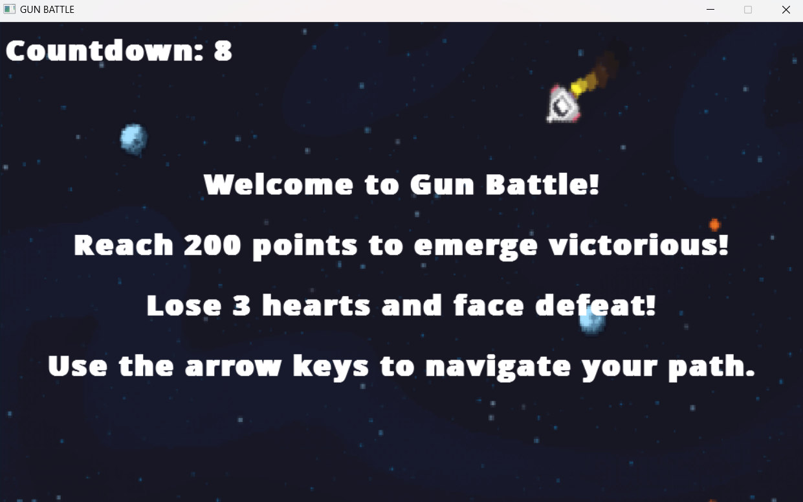

# Gun Battle
- Link preview game :  [youtube](https://youtu.be/8su-FWuEuZA)
## Giới thiệu
Gun Battle là một trò chơi bắn súng đơn giản được xây dựng bằng ngôn ngữ lập trình C++ và sử dụng thư viện đồ hoạ SDL. Trong trò chơi này, người chơi sẽ điều khiển một nhân vật và bắn hạ các kẻ địch để kiếm điểm.

## Cài đặt
Để chạy trò chơi, bạn cần có môi trường phát triển C++ (ví dụ: Visual Studio) và cài đặt thư viện SDL. Sau đó, bạn có thể mở mã nguồn và chạy trò chơi từ môi trường phát triển của mình.

## Hướng dẫn sử dụng
- Khi chạy trò chơi, bạn sẽ thấy một menu hiển thị lựa chọn "Start" và "Exit".
- Nếu bạn chọn "Start", game sẽ chuyển đến 1 menu hướng dẫn, sau đó 10 giây để đọc thông tin và chơi.
- Nếu bạn chọn "Exit", trò chơi sẽ kết thúc.
- Trong quá trình chơi, nếu bạn hạ được 20 mục tiêu hoặc đạt được 200 điểm (mỗi mục tiêu = 10 điểm) thì bạn thắng và màn hình sẽ hiển thị “You win“. Nếu bạn sử dụng hết trái tim thì bạn thua và màn hình sẽ hiển thị “Game over!”.
- Sau đó sẽ hiển thị menu end game gồm 2 lựa chọn: “play again“ và “exit”. Chọn “Play Again” sẽ chơi lại, còn chọn “Exit” sẽ thoát game.

## Nguồn 
Các hình ảnh trong game tự thiết kế hoặc tìm ngẫu nhiên trên Google và một số là ảnh screenshot.

## Bắt đầu game
- **Background Đầu Tiên (Menu):** 
  - Mô tả: Background này chứa các lựa chọn "Start" và "Exit" được viết bằng font.
  

- **Background Hướng Dẫn:**
  - Mô tả: Background này được sử dụng để hướng dẫn người chơi về cách chơi trò chơi. Và có đếm ngược 10s cho người chơi đọc thông tin 
  - Welcome to Gun Battle!
  - Reach 200 points to emerge victorious!
  - Lose 3 hearts and face defeat!
  - Use the arrow keys to navigate your path.
 
 

- **Background Game Chính:**
  - Mô tả: Background chính trong trò chơi, nơi diễn ra các hoạt động chính của trò chơi.
  

- **Background "End Game":**
  - Mô tả: Background được hiển thị khi trò chơi kết thúc.
  

- ## Source code
  - main.cpp :
  - - Khởi tạo các đối tượng SDL cần thiết.
  - - Vào vòng lặp menu chính, vẽ menu và xử lý sự kiện click chuột.
  - - Hàm initializeSDL():
  - Globals.h : Chứa các khai báo biến,mảng toàn cục và 1 số thư viện cần sử dụng.
  - GameRendering.cpp :
  - -  Hàm drawPlayer() :lấy ảnh Player .
  - -  Hàm drawBullets() :lấy ảnh đạn .
  - -  Hàm drawEnemies () :lấy ảnh địch .
  - -  Hàm drawScore() : dùng font để vẽ Score .
  - -  Hàm drawHearts() :lấy ảnh trái tim .
  - GameLogic.cpp :
  - - Hàm handleInput() : Xử lí đầu vào (Nhấn phím , chuột).
  - - Hàm movePlayer() : Xử lí di chuyển của player.
  - GameFlow.cpp :
  - - Hàm cleanup() : Giải phóng bộ nhớ .
  - - Hàm runGameLoop() : tách ra từ main để xử lí .
  - - Hàm drawMenu() : vẽ background đầu tiên (menu) .
  - - Hàm countdownTimer() : vẽ Background Hướng Dẫn.
  - - Hàm drawEndGameMenu() : vẽ Background "End Game" .
  - EnemyLogic.cpp :
  - - Xử lí sự xuất hiện ngẫu nhiên của địch
  -  - xử lí di chuyển của địch.
  - - Kiểm tra sự va chạm
  - - Kiểm tra việc di chuyển của địch khiến trái tim bị biến mất
  - BulletLogic.cpp :
  - - Xử lí việc di chuyển và tần suất xuất hiện của đạn.
  - - Kiểm tra va chạm
 
 ## Cài đặt
 - Unzip GameOfHoang.zip và chọn file .exe để chơi.
  
